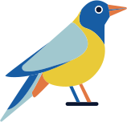

<!-- Profile README · 模板参考：minimal developer + github-readme-stats -->
<!-- 灵感来源：https://github.com/abhisheknaiidu/awesome-github-profile-readme -->


<p align="center">
  
</p>

<h3 align="center">
  <a href="https://git.io/typing-svg">
    
  </a>
</h3>

<p align="center">
  <a href="https://xiaolinstar.cn"></a>
  <a href="https://github.com/xiaolinstar/xiaolin-docs"></a>
  
</p>

---

### 👋 About

个人开发者 · 运维工程师 · 产品设计。专注 **可落地的 SRE / DevOps 实践** 与 **AI Agent 工程化**，长期维护技术站点与开源文档。

- 🌐 站点（权威原文）：[xiaolinstar.cn](https://xiaolinstar.cn)
- 📚 内容支柱：**Vibe Coding** · **云原生** · **独立产品**
- 🛠 正在折腾：VitePress 知识库全链路、creator-suite 内容分发、AI 待办等个人产品
- 📍 Nanjing

```yaml
focus:
  - CI/CD · K8s · 可观测性（Prometheus / Grafana / Loki）
  - Cursor · Agent Skills · Harness Engineering
  - 一人公司 · 文档即产品
philosophy: 不积跬步，无以至千里
```

---

### 🧰 Tech Stack

<p align="left">
  
  
  
  
  
  
  
  
  
  
</p>

---

### ⭐ Featured Projects

| 项目 | 说明 |
| :--- | :--- |
| [**xiaolin-docs**](https://github.com/xiaolinstar/xiaolin-docs) | VitePress 技术知识库 · CI/CD 与可观测性实践 · creator-suite 内容工作流 |
| [**AI 待办**](https://xiaolinstar.cn/products/ai-todo/) | AI 原生待办 · 微信小程序 + Agent / CLI 接入 |
| [**聚会助手**](https://xiaolinstar.cn/products/party-helper/) | 线下聚会场景的小程序发牌器 |

---

### 📊 GitHub Stats

<p align="center">
  
  
</p>

<p align="center">
  
</p>

<picture>
  <source media="(prefers-color-scheme: dark)" srcset="./dist/github-contribution-grid-snake-dark.svg">
  <source media="(prefers-color-scheme: light)" srcset="./dist/github-contribution-grid-snake.svg">
  
</picture>

---

### 📫 Connect

<p align="left">
  <a href="https://xiaolinstar.cn/about/"></a>
  <a href="mailto:xing.xiaolin@foxmail.com"></a>
  <a href="https://github.com/xiaolinstar"></a>
</p>


